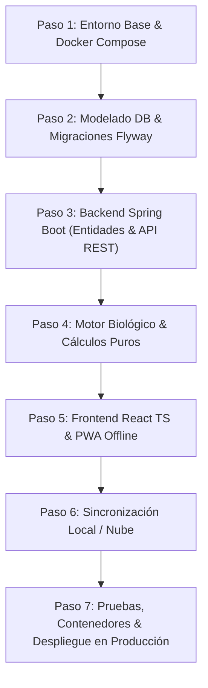

# Plan Maestro de Desarrollo: Sistema de Gestión Agropecuaria & Asesor de Decisiones con IA
## Proyecto: `jajodisant_managment_agro`

---

## 1. Visión General del Producto y Arquitectura

### 1.1 Objetivo del Sistema
Construir una plataforma integral para la gestión y toma de decisiones agropecuarias que inicie con un **MVP enfocado en Acuicultura (Piscicultura)** y evolucione de manera modular hacia **Ganadería, Agricultura, Automatización Financiera e Inteligencia Artificial Asistencial (RAG)**.

### 1.2 Justificación de la Arquitectura & Stack Tecnológico

| Componente | Tecnología | Justificación Técnica |
| :--- | :--- | :--- |
| **Base de Datos** | **PostgreSQL 16 + pgvector** | Integridad transaccional ACID estricta para inventario biológico y finanzas. Soporte `JSONB` para parámetros flexibles de especies. Soporte nativo de vectores (`pgvector`) para el motor RAG de IA sin requerir servicios externos como Pinecone o MongoDB Atlas. |
| **Backend** | **Java 21 LTS + Spring Boot 3.3+** | Tipado estricto, robustez corporativa, concurrencia de alto rendimiento, soporte nativo de `Spring AI`, seguridad avanzada (`Spring Security + JWT`), y aislamiento modular (Monolito Modular / Clean Architecture). |
| **Migraciones DB** | **Flyway** | Control de versiones evolutivo y reproducible del esquema SQL en entornos de desarrollo, staging y producción. |
| **Frontend** | **React 18+ con TypeScript + Vite** | SPA responsiva con tipado estricto para evitar inconsistencias en cálculos matemáticos de biomasa, gramos y dinero. |
| **Estrategia Multiplataforma**| **PWA (Progressive Web App)** | Permite operar en computadoras de escritorio (vista administrativa amplia, gráficos, reportes contables) y en celulares de campo de operarios (instalable como icono nativo, soporte offline mediante Service Workers y almacenamiento local). |
| **Persistencia Offline** | **IndexedDB (Dexie.js)** | Almacenamiento local en el dispositivo del operario para registrar raciones de alimento y biometrías sin conexión a internet en la orilla del estanque, con sincronización automática al recuperar cobertura. |
| **Contenedores** | **Docker & Docker Compose** | Entornos idénticos en desarrollo y producción, orquestando base de datos, backend y frontend con un solo comando. |
| **Control de Versiones** | **Git Flow Simplificado** | `main` (producción), `develop` (integración continua), y ramas de características `feature/*`. |

---

## 2. Mapa de Módulos Funcionales por Capas

```
+-------------------------------------------------------------------------------+
|  CAPA 4: INTELIGENCIA & MERCADO (IA, RAG, Proyecciones)                       |
|  - RAG con bitácora histórica y manuales técnicos (Req. 10)                   |
|  - Alertas estacionales y meteorológicas (Req. 6)                              |
|  - Proyección de ventanas óptimas de cosecha y precios de mercado (Req. 4, 9) |
+-------------------------------------------------------------------------------+
|  CAPA 3: MOTOR DE REGLAS & NOTIFICACIONES (Scheduler / Motor de Alertas)       |
|  - Horarios de alimentación y riego según etapa biológica (Req. 3)            |
|  - Alertas de vacunación, calidad de agua y contingencias (Req. 6)             |
+-------------------------------------------------------------------------------+
|  CAPA 2: ANÁLISIS & MOTOR BIOLÓGICO/FINANCIERO (Lógica de Negocio)            |
|  - Densidad de siembra y aforo de estanques/instalaciones (Req. 2)            |
|  - Curvas de crecimiento, ganancia diaria (GMD), biomasa y FCR (Req. 5)      |
|  - Costos de producción detallados: alimento, mano de obra, energía (Req. 7)  |
|  - Proyección de margen de rentabilidad en tiempo real ($/kg) (Req. 8)        |
+-------------------------------------------------------------------------------+
|  CAPA 1: NÚCLEO TRANSACCIONAL (Base de Datos Operativa)                       |
|  - Catálogo de especies y lotes biológicos (Req. 1)                           |
|  - Bitácora de eventos, biometrías y consumos diarios (Req. 5, 7, 10)         |
+-------------------------------------------------------------------------------+
```

---

## 3. Plan de Construcción por Fases (Roadmap Incremental)

### Fase 1: MVP Piscícola Operativo & Costos Directos (Meses 1 - 3)
* Enfoque: Dominio acuícola completo, CRUD de infraestructura, siembra, tablas de alimentación, biometrías, FCR automático, costo directo por kilo y funcionamiento PWA offline-first.

### Fase 2: Motor Financiero Completo & Cosecha Óptima (Meses 4 - 5)
* Enfoque: Costeo indirecto (mano de obra, depreciación, energía), punto de rendimiento decreciente de alimentación, cálculo de rentabilidad proyectada y reportes ejecutivos.

### Fase 3: Agro-IA (RAG), Alertas y Expansión Multiespecie (Meses 6 - 8)
* Enfoque: Activación de `pgvector` y `Spring AI`, bitácora asistida con LLM para diagnóstico de síntomas, alertas climáticas/estacionales, y apertura a módulos de Ganadería y Agricultura.

---

## 4. Historias de Usuario Detalladas (Criterios Gherkin / BDD)

### Épica 1: Infraestructura y Catálogo Biológico (Requisitos 1 y 2)

#### HU-01: Configuración de Estanques y Unidades de Producción
* **Como:** Administrador de la granja.
* **Quiero:** Registrar y parametrizar mis estanques (dimensiones, profundidad, tipo de estructura y si cuenta con aireación mecánica).
* **Para:** Conocer el volumen cúbico exacto ($m^3$) y la capacidad máxima de carga biológica de cada instalación.
* **Criterios de Aceptación:**
  * **Escenario 1:** Cálculo automático de volumen.
    * *Dado* que ingreso un estanque rectangular de 20 m de largo, 10 m de ancho y 1.5 m de profundidad.
    * *Cuando* guardo la configuración.
    * *Entonces* el sistema calcula automáticamente un volumen de 300 $m^3$.
  * **Escenario 2:** Asignación de densidad límite según aireación.
    * *Dado* que el estanque tiene activada la opción de aireación mecánica.
    * *Cuando* se guarda el estanque.
    * *Entonces* el sistema sugiere una densidad máxima superior (ej. hasta 10 kg/$m^3$) comparado con un estanque sin aireación (ej. máx 3 kg/$m^3$).

#### HU-02: Creación y Siembra de Lotes con Alerta de Aforo
* **Como:** Administrador o Técnico de la granja.
* **Quiero:** Registrar la siembra de un nuevo lote de peces asignándolo a un estanque, especificando especie, fecha, cantidad y peso promedio inicial.
* **Para:** Iniciar el ciclo productivo y evitar hacinamiento o sobrepoblación.
* **Criterios de Aceptación:**
  * **Escenario 1:** Alerta preventiva de sobrepoblación en siembra.
    * *Dado* un estanque con capacidad técnica máxima recomendada de 1,500 peces para peso a cosecha.
    * *Cuando* intento sembrar un lote de 2,500 alevines sin plan de desdoble/traslado registrado.
    * *Entonces* el sistema muestra una advertencia preventiva de sobrepoblación indicando el porcentaje de sobrecupo proyectado, requiriendo confirmación consciente del usuario para proceder.

---

### Épica 2: Operación Diaria y Métricas Biológicas (Requisitos 3 y 5)

#### HU-03: Horarios y Cálculo de Ración Diaria de Alimento
* **Como:** Operario de campo o piscicultor.
* **Quiero:** Ver la cantidad exacta de kilogramos y el tipo de concentrado que debo suministrar a cada lote según su peso y edad.
* **Para:** Alimentar con precisión según las tablas nutricionales técnicas y no por intuición.
* **Criterios de Aceptación:**
  * **Escenario 1:** Cálculo automático de la ración diaria según biomasa.
    * *Dado* un lote con biomasa estimada actual de 1,000 kg y peso promedio de 150 g por pez.
    * *Cuando* consulto la tarea diaria de alimentación basada en la tabla técnica de la especie (ej. 3.0% de la biomasa al día).
    * *Entonces* el sistema calcula una cuota diaria de 30 kg dividida en las raciones recomendadas (ej. 2 raciones de 15 kg a las 9:00 a.m. y 3:00 p.m.).

#### HU-04: Registro Ultrarrápido de Alimentación (Modo Terreno & Offline)
* **Como:** Operario de campo.
* **Quiero:** Marcar el suministro de la ración diaria con 1 o 2 toques desde el celular, incluso sin conexión a internet.
* **Para:** Mantener la bitácora al día sin interrumpir mis tareas operativas.
* **Criterios de Aceptación:**
  * **Escenario 1:** Registro offline con sincronización diferida.
    * *Dado* que el dispositivo se encuentra sin cobertura celular en la orilla del estanque.
    * *Cuando* el operario confirma la entrega de la ración de 15 kg.
    * *Entonces* el registro se almacena en el almacenamiento local del teléfono (IndexedDB) con marca de tiempo.
    * *Y* tan pronto el dispositivo detecta conexión Wi-Fi o datos móviles, la aplicación sincroniza silenciosamente el registro con la base de datos central en el backend.

#### HU-05: Registro de Biometrías y Cálculo Automático de FCR
* **Como:** Técnico acuícola.
* **Quiero:** Ingresar los datos de muestreos periódicos (número de peces pesados, peso total de la muestra y mortalidad observada).
* **Para:** Actualizar el peso promedio, la biomasa actual y calcular de inmediato la Ganancia Media Diaria (GMD) y el Factor de Conversión Alimenticia (FCR).
* **Criterios de Aceptación:**
  * **Escenario 1:** Cálculo automático de métricas tras biometría.
    * *Dado* un lote que inició con 10,000 peces de 5 g (50 kg iniciales) y ha consumido 1,200 kg acumulados de alimento.
    * *Cuando* registro un muestreo de 100 peces con peso total de 10,000 g (promedio 100 g) y descuento 200 bajas de mortalidad (población restante: 9,800 peces = 980 kg de biomasa).
    * *Entonces* el sistema calcula:
      * Ganancia neta de biomasa: $980\text{ kg} - 50\text{ kg} = 930\text{ kg}$.
      * FCR acumulado: $\frac{1,200\text{ kg}}{930\text{ kg}} = 1.29$.
      * Alerta visual: indicador verde si el FCR está dentro del rango esperado ($\le 1.35$) o ámbar/rojo si hay desviación por sobrealimentación o desperdicio.

---

### Épica 3: Costos y Rentabilidad en Tiempo Real (Requisitos 7, 8, 4 y 9)

#### HU-06: Estructura de Costos de Producción por Lote
* **Como:** Administrador financiero o propietario.
* **Quiero:** Registrar costos directos (alimento, alevines) e indirectos (jornales, combustible de motobombas, energía eléctrica).
* **Para:** Conocer el costo real acumulado y el costo de producción por kilogramo en cualquier momento del ciclo.
* **Criterios de Aceptación:**
  * **Escenario 1:** Costo por kilo en tiempo real.
    * *Dado* un lote con biomasa viva estimada de 2,500 kg y costos acumulados totales de $5,000 USD.
    * *Cuando* accedo a la ficha del lote.
    * *Entonces* el sistema muestra claramente el costo por kilogramo producido ($2.00 USD/kg).

#### HU-07: Proyección de Cosecha Óptima y Rendimiento Decreciente
* **Como:** Propietario de la granja.
* **Quiero:** Visualizar la ventana proyectada de cosecha según el precio de venta en el mercado y la curva de crecimiento del lote.
* **Para:** Decidir la fecha óptima de venta antes de que mantener vivo al pez cueste más de lo que rinde en peso.
* **Criterios de Aceptación:**
  * **Escenario 1:** Identificación del umbral de rentabilidad.
    * *Dado* que un lote alcanza su peso comercial objetivo (ej. 500 g) y su tasa de conversión comienza a deteriorarse a más de 1.8 FCR marginal.
    * *Cuando* el costo diario de alimentación supera la ganancia económica por incremento de peso diario (según el precio de venta de mercado registrado).
    * *Entonces* el sistema emite una recomendación de "Ventana de Cosecha Óptima Inmediata" indicando el margen de ganancia estimado proyectado.

---

### Épica 4: Asesor Inteligente, RAG y Alertas (Requisitos 6 y 10)

#### HU-08: Bitácora de Incidencias Asistida por IA (RAG)
* **Como:** Operario o administrador.
* **Quiero:** Describir en texto libre o mediante nota de voz una anomalía observada (ej. *"Estanque 3 amaneció con peces boqueando en la superficie, color verdoso y olor fuerte"*).
* **Para:** Recibir un diagnóstico preliminar sustentado en manuales técnicos y el histórico de la propia granja.
* **Criterios de Aceptación:**
  * **Escenario 1:** Respuesta contextualmente fundamentada sin alucinaciones.
    * *Dado* que el sistema cuenta con la base de conocimiento vectorial (`pgvector`) cargada con guías técnicas de calidad de agua y patología piscícola.
    * *Cuando* se envía la incidencia.
    * *Entonces* el asistente recupera los manuales pertinentes y el último registro de oxígeno del lote.
    * *Y* responde identificando anoxia matutina / déficit de oxígeno disuelto por floración algal, sugiriendo activar aireación de emergencia, recambio de agua y suspender la primera ración de alimento matutino, indicando la fuente técnica consultada.

#### HU-09: Sistema de Alertas Estacionales y Ambientales
* **Como:** Administrador de la granja.
* **Quiero:** Recibir alertas anticipadas basadas en fechas calendarias de transición climática (época de lluvias, sequías extremas) o riesgos sanitarios regionales.
* **Para:** Ejecutar protocolos preventivos (dosificación de probióticos, limpieza de compuertas, protección contra desbordamientos).
* **Criterios de Aceptación:**
  * **Escenario 1:** Activación de protocolo preventivo estacional.
    * *Dado* el inicio previsto de la temporada de lluvias torrenciales según la configuración regional.
    * *Cuando* llega el periodo definido en el calendario de contingencias.
    * *Entonces* el sistema genera notificaciones de recordatorio con una lista de verificación de tareas críticas (revisión de compuertas de alivio, stock de cal viva para amortiguar caídas de pH por lluvias).

---

## 5. Guía Paso a Paso: De Cero a Producción (MVP Piscícola)



### Paso 1: Configuración del Entorno de Infraestructura Local
1. Estructurar el repositorio con la siguiente disposición:
   ```
   jajodisant_managment_agro/
   ├── docker-compose.yml
   ├── .env.example
   ├── .gitignore
   ├── backend/
   └── frontend/
   ```
2. Crear el archivo `docker-compose.yml` base utilizando la imagen oficial `pgvector/pgvector:pg16` para disponer de PostgreSQL 16 con capacidades vectoriales listas para el futuro.

### Paso 2: Diseño de la Base de Datos & Flyway
1. Crear el primer script de migración en el backend:
   `backend/src/main/resources/db/migration/V1__init_schema.sql`
2. El script crea las tablas indispensables:
   * `granja` y `estanque` (con cálculo automático del volumen $m^3$ y validaciones de área).
   * `especie` y `tabla_alimentacion` (con rangos de peso y porcentajes de biomasa por etapa).
   * `lote` (con trazabilidad del ciclo de vida: siembra, levante, engorde, cosechado).
   * `registro_biometria` (muestreos de peso, mortalidad y biomasa calculada).
   * `registro_alimentacion` (raciones diarias suministradas, marcas y costos por kg).
   * `registro_costo` (costos directos e indirectos).
   * `bitacora_evento` (eventos y anomalías con campo para diagnósticos).
   * `vista_rendimiento_lote` (vista SQL para obtener FCR acumulado, biomasa actual y costo por kg sin recalcular manualmente en el cliente).

### Paso 3: Backend con Spring Boot 3.3+ (Java 21)
1. **Configuración de Dependencias (`pom.xml`):**
   * `spring-boot-starter-web`
   * `spring-boot-starter-data-jpa`
   * `spring-boot-starter-validation`
   * `spring-boot-starter-security` con soporte JWT
   * `flyway-core` + `flyway-database-postgresql`
   * `postgresql` driver
   * `lombok`
   * `springdoc-openapi-starter-webmvc-ui` (Swagger UI para documentación viva de la API)
2. **Estructura Interna por Capas / Paquetes:**
   * `com.agro.config`: CORS, Seguridad JWT, Manejador Global de Excepciones.
   * `com.agro.modules.farm`: Estanques, dimensiones, aforo.
   * `com.agro.modules.lot`: Lotes, fechas de siembra, estado del lote.
   * `com.agro.modules.biometry`: Muestreos y cálculo de biomasa.
   * `com.agro.modules.feeding`: Suministro de raciones y tablas de alimentación.
   * `com.agro.modules.finance`: Costos directos y cálculo acumulado de costo por kilogramo.
3. **Controladores REST y DTOs:**
   * Uso estricto de Java `record` para DTOs inmutables de entrada y salida (`CreateBiometriaRequest`, `LoteResumenResponse`, etc.).

### Paso 4: Implementación del Motor Biológico Puro
* Aislamiento de las fórmulas zootécnicas en servicios desacoplados con pruebas unitarias (`JUnit 5 + AssertJ`):
  * Cálculo de Biomasa Total: $\text{Población estimada} \times \text{Peso promedio (g)} / 1000$.
  * Ganancia Diaria de Peso: $\frac{\text{Peso actual (g)} - \text{Peso anterior (g)}}{\text{Días transcurridos}}$.
  * Factor de Conversión Alimenticia (FCR): $\frac{\text{Kg totales de alimento suministrado}}{\text{Kg netos de biomasa ganada}}$.
  * Costo de Producción por Kilo: $\frac{\text{Costo total de alimento} + \text{Costos adicionales}}{\text{Biomasa actual estimada en Kg}}$.

### Paso 5: Frontend con React, TypeScript y Tailwind CSS
1. Inicializar con Vite:
   ```bash
   npm create vite@latest frontend -- --template react-ts
   ```
2. Instalar y configurar:
   * **Tailwind CSS** para una interfaz limpia, botones táctiles grandes para campo y alto contraste para legibilidad bajo luz solar directa.
   * **Lucide React** para iconografía agropecuaria intuitiva.
   * **TanStack Query (React Query)** para caché eficiente de datos y reintentos automáticos.
   * **React Router DOM** para navegación modular.
3. **Habilitación de PWA:**
   * Instalar `vite-plugin-pwa`.
   * Configurar `manifest.webmanifest` con iconos, color de tema y modo `standalone`.
   * Registrar el Service Worker para almacenamiento en caché de la aplicación shell.

### Paso 6: Persistencia Local & Sincronización Offline
1. Configurar una base de datos del lado del cliente usando **Dexie.js (IndexedDB)**.
2. Almacenar temporalmente los registros de alimentación y biometría en una tabla local `pending_feeding_sync` si el navegador está sin conexión (`navigator.onLine === false`).
3. Escuchar el evento `window.addEventListener('online', syncPendingData)` para realizar un envío por lotes (`POST /api/v1/feeding/batch-sync`) y actualizar el estado local sin pérdida de datos.

### Paso 7: Preparación para Despliegue en Producción
1. **Dockerfile Multi-Stage para el Backend:**
   * Etapa de compilación con Maven + JDK 21.
   * Etapa de ejecución liviana con Eclipse Temurin JRE 21 Alpine, ejecutando la aplicación como usuario no-root.
2. **Dockerfile Multi-Stage para el Frontend:**
   * Etapa de compilación con Node.js Alpine (`npm run build`).
   * Etapa de producción con Nginx Alpine sirviendo los archivos estáticos y manejando rutas SPA (`try_files $uri /index.html`).
3. **Configuración de Producción:**
   * Configurar variables de entorno protegidas (`.env.production`).
   * Habilitar certificado SSL/TLS con Let's Encrypt mediante Nginx Reverse Proxy o Traefik.
   * Copias de seguridad automáticas programadas de PostgreSQL (`pg_dump` con cron diario).

---

## 6. Pasos Posteriores: Cumplimiento al 100% del Proyecto

### Expansión a Fase 2 (Motor Financiero Avanzado)
1. **Módulo de Costos Indirectos y Fijos:**
   * Depreciación de instalaciones (geomembrana, bombas, aireadores).
   * Asignación prorrateada de jornales y energía eléctrica por lote o por estanque.
2. **Algoritmo de Cosecha Óptima:**
   * Cruzar el FCR marginal semanal con el precio de mercado mayorista por kilogramo.
   * Generar alertas de venta cuando el costo marginal diario supere el valor del peso ganado.

### Expansión a Fase 3 (Agro-IA & RAG)
1. **Integración con Spring AI y pgvector:**
   * Habilitar la extensión: `CREATE EXTENSION IF NOT EXISTS vector;`.
   * Añadir columna de embedding a los documentos técnicos y a la bitácora: `embedding vector(1536)`.
2. **Indexación de Base de Conocimiento:**
   * Cargar manuales técnicos oficiales (calidad de agua, patologías, planes sanitarios de Tilapia/Trucha/Cachama).
   * Implementar chunking y generación de embeddings con modelos optimizados (ej. text-embedding-004 o similar).
3. **Asistente Técnico Conversacional:**
   * Crear endpoint `POST /api/v1/ai/consultar-caso` que reciba los síntomas observados, extraiga el contexto histórico del estanque (últimos parámetros de agua y peso) y recupere los fragmentos de manuales técnicos para generar una recomendación médica con citación de fuentes.
4. **Módulo Multiespecie:**
   * Crear abstracción `UnidadProduccion` para abarcar Potreros (ganadería bovina) y Lotes de Terreno (agricultura).
   * Adaptar las métricas de densidad a Unidades Gran Ganado por hectárea (UGG/ha) y distanciamiento entre surcos.

---

## 7. Plan de Control de Calidad y Pruebas

| Tipo de Prueba | Herramienta | Alcance |
| :--- | :--- | :--- |
| **Pruebas Unitarias** | JUnit 5, Mockito | Lógica matemática de fórmulas acuícolas (FCR, GMD, aforo, proyecciones financieras). |
| **Pruebas de Integración** | `@SpringBootTest`, Testcontainers | Persistencia real con PostgreSQL en contenedor efímero, validando scripts de Flyway. |
| **Pruebas de Contratos de API** | Postman / Newman o MockMvc | Validación de esquemas JSON y códigos de respuesta HTTP de cada endpoint. |
| **Pruebas Frontend E2E** | Playwright o Cypress | Flujo completo de registro de estanque, siembra, suministro de ración y consulta de métricas. |
| **Pruebas de Resiliencia Offline** | Chrome DevTools Network Throttling | Verificación del almacenamiento en IndexedDB sin conexión y sincronización al restaurar red. |
