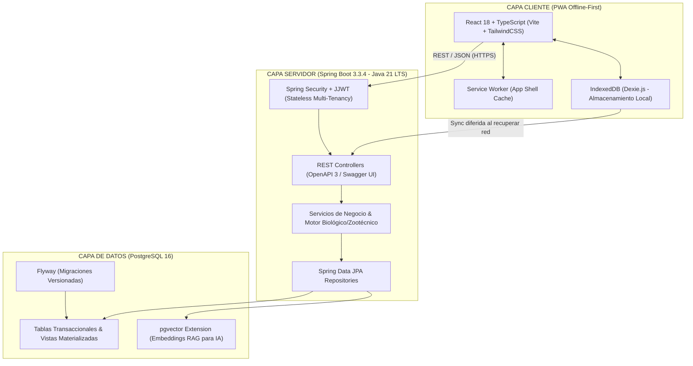

<div align="center">

# 🐟 AGRO-AI MANAGEMENT SYSTEM
### *Plataforma Inteligente de Gestión Agropecuaria & Asesor de Decisiones con IA*

[](https://openjdk.org/projects/jdk/21/)
[](https://spring.io/projects/spring-boot)
[](https://www.postgresql.org/)
[](https://github.com/pgvector/pgvector)
[](https://react.dev/)
[](https://www.docker.com/)
[](#licencia)

<p align="center">
  <b>Optimizando la conversión alimenticia, costos en tiempo real y toma de decisiones zootécnicas en campo mediante arquitecturas Clean Architecture, Offline-First (PWA) e Inteligencia Artificial RAG.</b>
</p>

[Visión General](#-visión-general) •
[Arquitectura](#-arquitectura-del-sistema) •
[Características](#-capacidades-y-reglas-zootécnicas) •
[Guía de Instalación](#-guía-paso-a-paso-de-instalación-y-uso) •
[Referencia de API](#-referencia-rápida-de-la-api-rest) •
[Roadmap](#-roadmap-y-estado-de-avance) •
[Metodología](#-flujo-de-trabajo-y-metodología-git-flow)

---

</div>

## 📖 Visión General

El **Sistema de Gestión Agropecuaria (`AGRO-AI-SYS`)** es una solución corporativa diseñada para transformar la administración empírica de granjas en una operación de **precisión basada en datos biológicos y financieros**. 

Inicia con un **MVP de alta especialización en Acuicultura (Piscicultura intensiva y semi-intensiva)** enfocado en especies comerciales de alto impacto (**Tilapia Roja/Negra, Trucha Arcoíris, Cachama**), con una arquitectura modular escalable hacia **Ganadería Bovina** y **Agricultura de Precisión**.

### 🎯 Problemas Críticos que Resuelve
1. **Desperdicio de Alimento (65%–75% del costo de producción):** Cálculo automatizado de raciones según curvas nutricionales por gramaje de pez, evitando la sobrealimentación y el deterioro del agua.
2. **Ceguera Financiera del Ciclo:** Costeo acumulado en tiempo real por kilogramo producido ($/kg vivo) cruzando insumos directos (alevinos, concentrado) y costos indirectos.
3. **Pérdida de Datos en Campo:** Operación **Offline-First (PWA)** que permite al operario registrar alimentación y muestreos en la orilla del estanque sin cobertura celular, sincronizando automáticamente al reconectar.
4. **Respuesta Tardía a Mortalidades:** Bitácora asistida con IA (RAG sobre `pgvector`) para diagnosticar anomalías en parámetros de agua (anoxia, amonio, patologías).

---

## 🏛️ Arquitectura del Sistema

El sistema implementa un **Monolito Modular con Clean Architecture**, separando responsabilidades por capas y permitiendo que cada módulo biológico evolucione con alta cohesión y bajo acoplamiento:



---

## 🧮 Capacidades y Reglas Zootécnicas

El núcleo del sistema integra las formulaciones zootécnicas estandarizadas de la acuicultura moderna:

### 1. Cálculo Automático de Volumen y Capacidad de Carga (HU-01)
* **Volumen de Agua ($m^3$):** Calculado inmutablemente a nivel de base de datos (`STORED GENERATED COLUMN`):
  $$\text{Volumen } (m^3) = \text{Largo (m)} \times \text{Ancho (m)} \times \text{Profundidad Media (m)}$$
* **Límite de Aforo Zootécnico por Aireación:**
  * **Sin aireación mecánica:** Máximo sugerido de **$3.0\text{ kg}/m^3$** (evita hipoxia y acumulación de amonio no ionizado).
  * **Con aireación mecánica forzada:** Hasta **$10.0\text{ kg}/m^3$** (splasher, blower o paletas).
  * **Capacidad Máxima de Biomasa:** $\text{Capacidad (kg)} = \text{Volumen } (m^3) \times \text{Densidad Máxima } (\text{kg}/m^3)$.

### 2. Factor de Conversión Alimenticia (FCR - HU-05)
El indicador fundamental de eficiencia técnico-económica de la granja:
$$\text{FCR} = \frac{\sum \text{Kilogramos Totales de Alimento Suministrado}}{\text{Biomasa Final (kg)} - \text{Biomasa Inicial Sembrada (kg)} + \text{Biomasa Cosechada (kg)}}$$
*Semáforo de control:* Verde ($\le 1.35$), Ámbar ($1.36 - 1.55$), Rojo ($> 1.55$).

### 3. Ganancia Media Diaria (GMD)
$$\text{GMD (g/día)} = \frac{\text{Peso Promedio Actual (g)} - \text{Peso Promedio Anterior (g)}}{\text{Días Transcurridos entre Muestreos}}$$

### 4. Costo Unitario de Producción en Tiempo Real (HU-06)
$$\text{Costo Unitario (\$/kg)} = \frac{\text{Costo Alimento} + \text{Costo Alevinos} + \text{Mano de Obra} + \text{Insumos Directos}}{\text{Biomasa Viva Estimada (kg)}}$$

---

## 💻 Stack Tecnológico Detallado

| Componente | Tecnología | Rol y Justificación Técnica |
| :--- | :--- | :--- |
| **Lenguaje Backend** | **Java 21 LTS** | Rendimiento enterprise, Virtual Threads, Records inmutables y Pattern Matching. |
| **Framework Backend** | **Spring Boot 3.3.4** | Inyección de dependencias, transaccionalidad ACID y soporte nativo para Spring AI. |
| **Persistencia** | **Spring Data JPA / Hibernate 6** | Mapeo objeto-relacional tipado con control de consultas optimizadas (`LAZY`). |
| **Seguridad** | **Spring Security + JJWT 0.12.6** | Autenticación basada en tokens JWT con aislamiento multi-tenancy (`ownerId`). |
| **Control de Versiones BD**| **Flyway** | Migraciones SQL versionadas, reproducibles y consistentes en todos los entornos. |
| **Base de Datos** | **PostgreSQL 16 + pgvector** | Motor relacional robusto con capacidad vectorial para modelos de lenguaje (RAG). |
| **Documentación Viva** | **Springdoc OpenAPI 2.6.0** | Swagger UI interactivo generado automáticamente desde código fuente. |
| **Frontend** | **React 18 + TypeScript + Vite** | SPA responsiva de tipado estricto para operaciones financieras y cálculos de campo. |
| **Estilos & UI** | **TailwindCSS + Lucide Icons** | Diseño de alto contraste adaptado para lectura táctil bajo sol directo en campo. |
| **Persistencia Offline** | **IndexedDB (Dexie.js)** | Almacenamiento local del dispositivo móvil para captura sin internet. |
| **Contenedores** | **Docker & Docker Compose** | Infraestructura idéntica en desarrollo local, staging y producción. |

---

## 🚀 Guía Paso a Paso de Instalación y Uso

### 1. Requisitos Previos del Sistema
Asegúrate de tener instaladas las siguientes herramientas en tu sistema operativo:
* [Docker Desktop / Docker Engine](https://docs.docker.com/engine/install/) y Docker Compose v2.
* [JDK 21 LTS](https://adoptium.net/) (Eclipse Temurin o compatible).
* [Apache Maven 3.9+](https://maven.apache.org/download.cgi).
* [Node.js 20+ LTS](https://nodejs.org/) y `npm` (para el frontend).
* [Git](https://git-scm.com/).

---

### 2. Clonar el Repositorio
```bash
git clone https://github.com/Jajodisant/jajodisant_managment_agro.git
cd jajodisant_managment_agro
```

---

### 3. Configurar Variables de Entorno
El proyecto incluye una plantilla base preconfigurada con valores seguros para desarrollo:
```bash
# Copiar el archivo de ejemplo a la configuración local
cp .env.example .env
```

*Contenido de referencia del archivo `.env`:*
```properties
# Base de Datos
POSTGRES_DB=agro_db
POSTGRES_USER=admin
POSTGRES_PASSWORD=admin123
POSTGRES_PORT=5433

# Backend Spring Boot
SERVER_PORT=8080
SPRING_DATASOURCE_URL=jdbc:postgresql://localhost:5433/agro_db
SPRING_DATASOURCE_USERNAME=admin
SPRING_DATASOURCE_PASSWORD=admin123
JWT_SECRET=f8a976c806952ca540245f93d951f52dff45886380c0be5cbf5611b7c9e8e838
```

---

### 4. Levantar la Base de Datos con Docker
Inicia el contenedor de PostgreSQL 16 con `pgvector` en segundo plano:
```bash
docker compose up -d postgres
```

*Verificar el estado del contenedor:*
```bash
docker compose ps
# Debe mostrar: agro_postgres ... Up (healthy) ... 0.0.0.0:5433->5432/tcp
```

---

### 5. Compilar y Levantar el Backend (Spring Boot)

1. Ingresar al directorio del backend:
   ```bash
   cd backend
   ```
2. Compilar el proyecto con Maven y validar que las entidades compilen limpiamente:
   ```bash
   mvn clean compile
   ```
3. Ejecutar las pruebas automatizadas:
   ```bash
   mvn test
   ```
4. Iniciar la aplicación:
   ```bash
   mvn spring-boot:run
   ```
   *La aplicación arrancará en el puerto `8080` con el contexto `/api/v1`.*

---

### 6. Explorar la Documentación Interactiva (Swagger UI)
Una vez levantado el backend, abre tu navegador web en:
👉 **[http://localhost:8080/api/v1/swagger-ui/index.html](http://localhost:8080/api/v1/swagger-ui/index.html)**

Desde esta consola interactiva puedes probar directamente cada endpoint REST, consultar los esquemas JSON de entrada y validar los códigos de respuesta HTTP.

---

### 7. Levantar el Frontend (React + Vite PWA)
*(En una terminal separada)*:
```bash
cd frontend
npm install
npm run dev
```
Accede a la interfaz web en: **[http://localhost:5173](http://localhost:5173)**.

---

## 📡 Referencia Rápida de la API REST

A continuación se muestran ejemplos reales de uso mediante comandos `curl`:

### 1. Crear una Granja / Unidad Productiva Raíz
```bash
curl -X POST http://localhost:8080/api/v1/farms \
  -H "Content-Type: application/json" \
  -H "X-Owner-Id: a0000000-0000-0000-0000-000000000001" \
  -d '{
    "name": "Piscícola San Jerónimo",
    "location": "Vereda El Porvenir, Meta, Colombia"
  }'
```

*Respuesta esperada (`201 Created`):*
```json
{
  "id": "3fa85f64-5717-4562-b3fc-2c963f66afa6",
  "name": "Piscícola San Jerónimo",
  "ownerId": "a0000000-0000-0000-0000-000000000001",
  "location": "Vereda El Porvenir, Meta, Colombia",
  "pondsCount": 0,
  "createdAt": "2026-09-22T15:30:00Z"
}
```

---

### 2. Parametrizar un Estanque con Cálculo de Volumen y Aforo (HU-01)
```bash
curl -X POST http://localhost:8080/api/v1/farms/3fa85f64-5717-4562-b3fc-2c963f66afa6/ponds \
  -H "Content-Type: application/json" \
  -H "X-Owner-Id: a0000000-0000-0000-0000-000000000001" \
  -d '{
    "codeName": "Estanque T-01",
    "pondType": "earthen",
    "lengthM": 20.00,
    "widthM": 10.00,
    "avgDepthM": 1.50,
    "hasAeration": true
  }'
```

*Respuesta calculada automáticamente (`201 Created`):*
```json
{
  "id": "7c9e6679-7425-40de-944b-e07fc1f90ae7",
  "farmId": "3fa85f64-5717-4562-b3fc-2c963f66afa6",
  "farmName": "Piscícola San Jerónimo",
  "codeName": "Estanque T-01",
  "pondType": "earthen",
  "lengthM": 20.00,
  "widthM": 10.00,
  "avgDepthM": 1.50,
  "volumeM3": 300.00,
  "hasAeration": true,
  "maxDensityKgM3": 10.00,
  "maxBiomassCapacityKg": 3000.00,
  "isActive": true,
  "createdAt": "2026-09-22T15:35:00Z"
}
```
> **Nota Zootécnica:** El sistema computó un volumen de **300.00 $m^3$** y, dado que `hasAeration = true`, asignó automáticamente la densidad técnica superior de **$10.00\text{ kg}/m^3$**, estableciendo una capacidad máxima de biomasa de **3,000.00 kg** de pez vivo.

---

### 3. Listar Estanques Activos de una Granja
```bash
curl -X GET "http://localhost:8080/api/v1/farms/3fa85f64-5717-4562-b3fc-2c963f66afa6/ponds?onlyActive=true" \
  -H "X-Owner-Id: a0000000-0000-0000-0000-000000000001"
```

---

## 📁 Estructura del Repositorio

```text
jajodisant_managment_agro/
├── docker-compose.yml             # Orquestador local de PostgreSQL 16 con pgvector
├── .env.example                   # Plantilla de variables de entorno de desarrollo
├── .gitignore                     # Exclusiones de Git (documentos internos locales)
├── README.md                      # Presentación ejecutiva y manual del sistema
│
├── backend/                       # API REST Spring Boot (Java 21 LTS)
│   ├── pom.xml                    # Gestión de dependencias Maven
│   └── src/
│       ├── main/
│       │   ├── java/com/agro/
│       │   │   ├── AgroApplication.java      # Punto de entrada principal Spring Boot
│       │   │   ├── common/                  # Manejador global de excepciones y DTOs comunes
│       │   │   ├── config/                  # Seguridad JWT, CORS y OpenAPI/Swagger
│       │   │   └── modules/                 # Módulos de Clean Architecture por dominio
│       │   │       ├── farm/                # Granjas y Estanques (Aforo zootécnico HU-01)
│       │   │       ├── species/             # Catálogo biológico y tablas nutricionales
│       │   │       ├── lot/                 # Lotes, siembras y ciclo de vida (HU-02)
│       │   │       ├── biometry/            # Muestreos, GMD y cálculo de FCR (HU-05)
│       │   │       ├── feeding/             # Raciones diarias y sync offline (HU-03, HU-04)
│       │   │       ├── finance/             # Costos directos y $/kg acumulado (HU-06)
│       │   │       └── advisory/            # Bitácora e inteligencia asistencial (HU-08)
│       │   └── resources/
│       │       ├── application.yml          # Configuración del servidor, DataSource y JWT
│       │       └── db/migration/            # Scripts de versión Flyway (V1__init_schema.sql)
│       └── test/                            # Pruebas unitarias zootécnicas con JUnit 5 & Mockito
│
└── frontend/                      # Aplicación PWA Offline-First (React 18 + TS + Vite)
    ├── package.json
    ├── vite.config.ts
    └── src/
        ├── components/            # Componentes UI reutilizables
        ├── services/              # Clientes API REST y Dexie.js (IndexedDB local)
        └── pages/                 # Vistas de operación en campo y administración
```

---

## 📊 Roadmap y Estado de Avance

```
Progreso General del MVP (Fase 1): [██████████████░░░░░░░░░░░░░░░░░░░░░░░░] 36%
```

* **Fase 1: MVP Piscícola Operativo & Costos Directos (Meses 1 - 3):**
  * [x] **Infraestructura Base:** Docker Compose, PostgreSQL 16 con `pgvector`, Spring Boot 3.3.4 (PR #1).
  * [x] **Base de Datos:** Migración Flyway `V1__init_schema.sql` con 9 tablas, índices y vistas (PR #2).
  * [x] **Dominio JPA:** 10 entidades mapeadas y probadas en compilación (PR #3).
  * [x] **Persistencia Farm & Pond:** Repositorios JPA y DTOs inmutables con Javadoc exhaustivo (PR #5).
  * [ ] **Lógica & API Farm & Pond:** Servicios zootécnicos de aforo (HU-01) y endpoints REST (En curso).
  * [ ] **Catálogo de Especies & Tablas Nutricionales:** Rangos de peso y curvas de alimentación.
  * [ ] **Lotes y Siembras (HU-02):** Ciclo productivo y prevención de sobrecupo en siembra.
  * [ ] **Biometrías y Conversión FCR (HU-05):** Cálculo automático de FCR y semáforos de eficiencia.
  * [ ] **Alimentación y Sync Offline (HU-03, HU-04):** Registro ultrarrápido con Dexie.js / IndexedDB.
  * [ ] **Costeo Real por Kilo (HU-06):** Costo de producción acumulado en tiempo real ($/kg).
  * [ ] **Frontend PWA:** Interfaz táctil de alto contraste para campo.

* **Fase 2: Motor Financiero Completo & Cosecha Óptima (Meses 4 - 5):**
  * [ ] Costeo indirecto (energía, depreciación de geomembrana y motobombas, jornales).
  * [ ] Algoritmo de punto de rendimiento decreciente y ventana óptima de cosecha (HU-07).

* **Fase 3: Agro-IA (RAG), Alertas y Expansión Multiespecie (Meses 6 - 8):**
  * [ ] Activación de embeddings en `pgvector` y conexión con `Spring AI`.
  * [ ] Bitácora con diagnóstico asistido por LLM ante anomalías en estanques (HU-08).
  * [ ] Alertas climáticas y estacionales preventivas (HU-09).
  * [ ] Expansión multiespecie a Ganadería y Agricultura.

---

## 🔀 Flujo de Trabajo y Metodología (Git Flow)

El proyecto sigue un estándar riguroso de desarrollo colaborativo para garantizar trazabilidad y calidad de código:

1. **Ramas Principales:**
   * `main`: Código estable de producción.
   * `develop`: Integración continua de funcionalidades probadas.
2. **Ramas de Trabajo:**
   * `feature/<nombre-modulo>`: Desarrollo de nuevas capacidades.
   * `docs/<tema>`: Mejoras de documentación.
   * `fix/<descripcion>`: Corrección de fallos.
3. **Regla de Integración:** Ningún desarrollador realiza commits directos sobre `main` o `develop`. Todo cambio requiere:
   - Compilación y pruebas locales limpias con Maven (`mvn clean test`).
   - Pull Request (PR) hacia `develop`.
   - Revisión y merge asistido.

---

## 📄 Licencia

Este proyecto es software privado y propietario. Todos los derechos reservados © 2026. Prohibida su copia, distribución o reproducción no autorizada.
