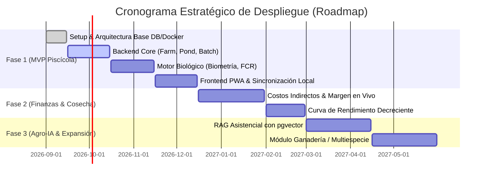

# DOCUMENTO DE VISIÓN Y CASO DE NEGOCIO (PROJECT CHARTER)
## Sistema Integral de Gestión Agropecuaria y Asesor de Decisiones con Inteligencia Artificial
**Código de Proyecto:** `AGRO-AI-SYS`  
**Repositorio:** `jajodisant_managment_agro`  
**Rol del Documento:** Marco Estratégico, Justificación de Negocio, Alcance y Métricas de Éxito  
**Elaborado por:** Project Management & AgTech Advisory Practice  

---

## 1. RESUMEN EJECUTIVO (EXECUTIVE SUMMARY)

El sector agropecuario y acuícola en América Latina y mercados emergentes enfrenta una brecha crítica de productividad caracterizada por la gestión empírica, la ausencia de trazabilidad financiera en tiempo real y la desconexión entre los manuales técnicos agronómicos y la operación diaria en campo.

Este proyecto tiene como objetivo diseñar, construir y desplegar un **Sistema de Gestión de Explotaciones Agropecuarias asistido por Inteligencia Artificial (Farm Management System + AI Advisory)**. La plataforma inicia con un **MVP de alta especialización en Acuicultura (Piscicultura)** —el subsector de producción animal con mayor retorno marginal sobre la eficiencia alimenticia— y está concebida arquitecturalmente para escalar de manera modular hacia **Ganadería de Precisión, Agricultura Protegida y Contabilidad Integral**.

La plataforma transforma los registros tradicionales de cuadernos de campo en un motor inteligente de decisiones zootécnicas y financieras, operando bajo un paradigma **Offline-First PWA** que garantiza continuidad operativa incluso al borde del estanque sin señal de red.

---

## 2. EL PROBLEMA Y LA OPORTUNIDAD DE MERCADO (BUSINESS CASE)

### 2.1 Diagnóstico de la Situación Actual
* **El Alimento es el 60% al 75% del Costo Operativo:** En piscicultura (Tilapia, Trucha, Cachama), el alimento balanceado representa entre las dos terceras partes y tres cuartos de los costos de producción. La sobrealimentación no solo destruye los márgenes por desperdicio de comida, sino que deteriora la calidad del agua (caída de oxígeno, picos de amonio), disparando la mortalidad hasta en un 25%.
* **Decisiones a Ciegas (La trampa del FCR tardío):** La mayoría de productores calculan el Factor de Conversión Alimenticia (FCR) al final de la cosecha (después de 6 meses). Para ese momento, cualquier ineficiencia ya es una pérdida económica irreversible.
* **Falta de Costo en Tiempo Real ($/kg):** Los productores conocen el precio de venta en plaza, pero desconocen si su costo por kilo vivo hoy es de $1.80 o $2.40 USD/kg. Esto ocasiona que mantengan peces en engorde durante semanas en rendimientos decrecientes, donde cada día extra comiendo cuesta más dinero del que el pez gana en peso.
* **Acceso Limitado a Asistencia Técnica Especializada:** Un zootecnista o médico veterinario no visita la finca a diario. Cuando ocurre un evento anómalo (anoxia matutina, peces boqueando, hongos, comportamiento errático), las decisiones se toman por ensayo y error con altos índices de mortalidad evitable.

### 2.2 Estadísticas del Sector & Justificación del Impacto

| Métrica / Parámetro | Impacto de la Industria Tradicional | Meta / Impacto con la Plataforma | Fuente / Referencia |
| :--- | :--- | :--- | :--- |
| **Factor de Conversión Alimenticia (FCR)** | 1.60 – 1.85 (típico en fincas no tecnificadas) | **1.25 – 1.35** (control mediante curvas automáticas) | FAO / Aquaculture Reports |
| **Ahorro Financiero Directo en Alimento** | Margen erosionado | **Reducción del 12% al 18% en costos directos de comida** | World Aquaculture Society |
| **Tasa de Mortalidad Evitable** | 15% – 25% acumulada por ciclo | **Reducción a < 7%** con alertas de calidad de agua | National Oceanic and Atmospheric Admin |
| **Tiempo de Detección de Anomalías Sanitarias**| 24 a 48 horas (reacción tardía post-mortalidad) | **< 2 horas** vía Asistente RAG con bitácora rápida | Casos de estudio AgTech / AI in Farming |
| **Disponibilidad de Datos en Campo** | 0% en zonas remotas (registro en papel) | **100% Offline** (PWA + sincronización local) | Estándares PWA / Dexie.js |

> **Ejemplo de Retorno Económico Tangible (Granja Mediana - 50,000 tilapias/ciclo):**
> * Producción estimada: 25,000 kg de carne.
> * Con FCR tradicional de 1.65: Requiere 41,250 kg de concentrado ($45,375 USD a $1.10/kg).
> * Con FCR optimizado de 1.35 gracias al software: Requiere 33,750 kg de concentrado ($37,125 USD).
> * **Ahorro neto directo por ciclo de 6 meses:** **$8,250 USD en un solo estanque o pequeña batería de producción.** La plataforma se paga sola desde el primer lote.

---

## 3. VISIÓN DEL PRODUCTO: ¿QUÉ ES Y QUÉ BUSCA ESTE SISTEMA?

### 3.1 Qué es
Es un **Asistente Integral de Gestión y Toma de Decisiones Agropecuarias** que combina:
1. Un **ERP / Núcleo Transaccional Zootécnico** que lleva el control riguroso de instalaciones, siembras, muestreos biométricos, mortalidad y consumos diarios de concentrado.
2. Un **Motor Financiero Continuo** que recalcula el costo marginal acumulado y el costo de producción por kilogramo producido ($/kg) con cada bulto de alimento suministrado o gasto de mano de obra/energía registrado.
3. Un **Optimizador de Cosecha Comercial** que detecta la curva de rendimiento decreciente y sugiere al productor la ventana óptima de salida antes de que la ganancia de peso se vuelva deficitaria.
4. Un **Copiloto de IA Especializado (RAG - Retrieval-Augmented Generation)** entrenado con manuales técnicos agropecuarios y el histórico de la propia granja para diagnosticar síntomas y emitir protocolos de contingencia inmediatos.

### 3.2 Qué busca a Mediano y Largo Plazo
* **Fase 1 (Inmediata):** Consolidar el estándar de gestión piscícola en campo, demostrando ahorro tangible en FCR y costos para productores de tilapia y trucha.
* **Fase 2 (Maduración Comercial):** Automatizar proyecciones comerciales, conexión con listas de precios de mercados mayoristas y reportes bancarios certificados para acceso a créditos agropecuarios.
* **Fase 3 (Expansión Multiespecie & AI Advisory):** Extender el motor de reglas a **Ganadería Bovina** (cálculo de Unidades Gran Ganado - UGG por hectárea, rotación de praderas, aforo de pastos) y **Agricultura** (densidades de siembra por surco, balance hídrico y fertilización), potenciado por el modelo conversacional con memoria histórica.

---

## 4. PRINCIPIOS DE DISEÑO & DISCIPLINA DE INGENIERÍA

Para asegurar que el proyecto no colapse bajo la complejidad del alcance, se aplican las siguientes reglas de arquitectura corporativa:

1. **Monolito Modular (Domain-Driven Design - DDD):**
   * Cada módulo (`farm`, `species`, `lot`, `biometry`, `feeding`, `finance`, `advisory`) vive encapsulado con sus propios controladores, servicios, repositorios y entidades. Esto permite que el sistema crezca sin código espagueti y pueda dividirse en microservicios a futuro si el volumen lo amerita.
2. **PostgreSQL como Fuente Única de Verdad (Single Source of Truth):**
   * Integridad referencial estricta (FKs, CHECK constraints, tipos numéricos de precisión fija).
   * Almacenamiento híbrido: tablas normalizadas para contabilidad y columnas `JSONB` / `pgvector` para parámetros dinámicos y embeddings de IA.
3. **Offline-First & Ergonomía de Campo:**
   * La interfaz del operario debe funcionar con 1 o 2 pulsaciones grandes en pantalla, con alto contraste bajo la luz del sol, y almacenar las operaciones en el dispositivo móvil aunque se corte la conexión.
4. **Gobierno Estricto de Código (Git Flow):**
   * `main` representa código productivo e inmutable.
   * `develop` integra las funcionalidades completas.
   * Todo cambio nace en una rama `feature/*` y entra exclusivamente mediante Pull Request documentado con pruebas y validación de esquema.

---

## 5. MAPA DE RUTA HACIA EL ÉXITO (MILESTONES & RELEASES)

---

## 6. FACTORES CRÍTICOS DE ÉXITO (KPIs DEL PROYECTO)

1. **KPI Técnico:** Tiempo de sincronización de datos de campo inferior a 3 segundos tras recuperar conexión a internet.
2. **KPI Operativo:** Registro de ración de alimento completado por el operario en menos de 10 segundos desde su celular.
3. **KPI Financiero / Zootécnico:** Desviación menor al 2% entre el FCR y costo proyectado por el software versus el balance real al momento del vaciado/cosecha del estanque.
4. **KPI de Adopción:** Cero pérdidas de información en bitácora gracias a la persistencia en IndexedDB y transaccionalidad ACID en PostgreSQL.
