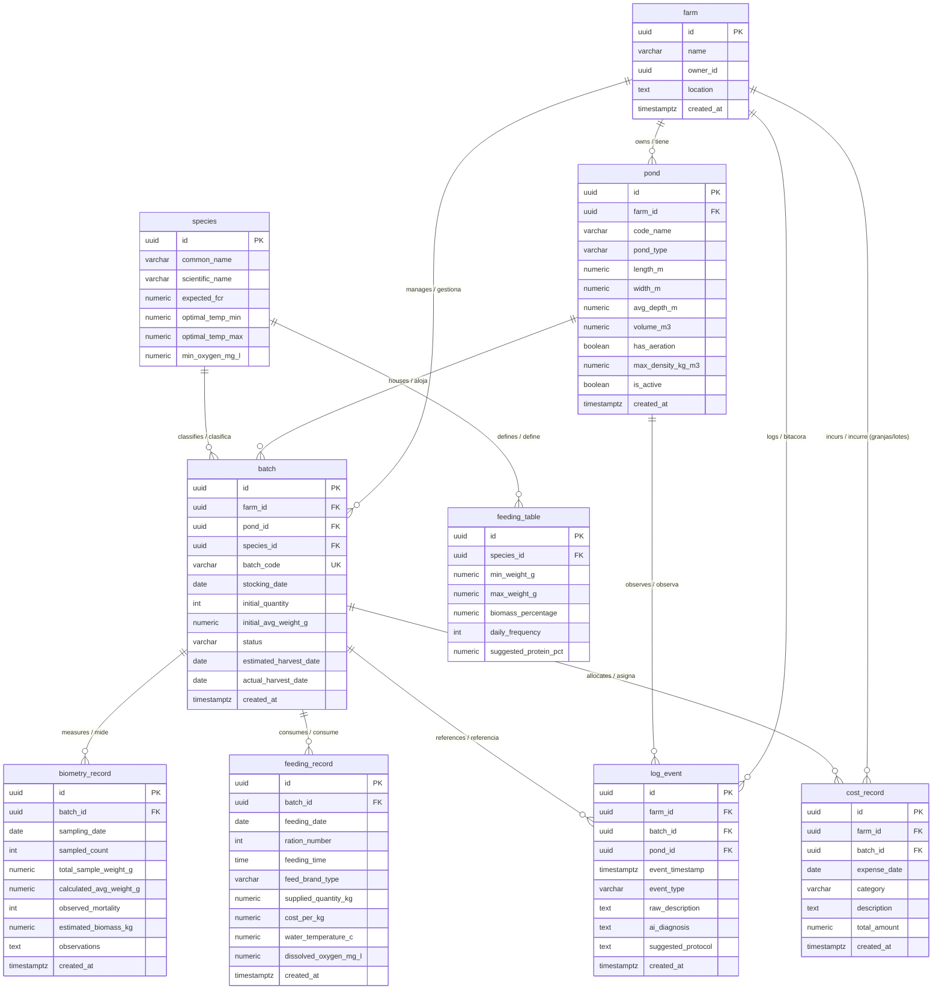

# Entity-Relationship Diagram (ERD) - Agro Management System

This document outlines the visual schema and relationships for the core operational, biological, and financial tables of the aquaculture MVP.

---

## 1. Visual Entity-Relationship Diagram (Mermaid)

---

## 2. Table Summary & Cardinalities

| Entity (English) | Spanish Meaning | Primary Key | Foreign Keys | Relationship |
| :--- | :--- | :--- | :--- | :--- |
| **`farm`** | Granja | `id (UUID)` | None | 1 to N with `pond`, `batch`, `cost_record`, `log_event` |
| **`pond`** | Estanque | `id (UUID)` | `farm_id` | 1 to N with `batch` and `log_event` |
| **`species`** | Especie | `id (UUID)` | None | 1 to N with `feeding_table` and `batch` |
| **`feeding_table`** | Tabla de Alimentación | `id (UUID)` | `species_id` | N to 1 with `species` |
| **`batch`** | Lote Biológico | `id (UUID)` | `farm_id`, `pond_id`, `species_id` | 1 to N with biometry, feeding, costs, logs |
| **`biometry_record`**| Registro de Biometría | `id (UUID)` | `batch_id` | N to 1 with `batch` |
| **`feeding_record`** | Registro de Alimentación | `id (UUID)` | `batch_id` | N to 1 with `batch` |
| **`cost_record`** | Registro de Costos | `id (UUID)` | `farm_id`, `batch_id (nullable)` | N to 1 with `farm` and `batch` |
| **`log_event`** | Bitácora de Eventos | `id (UUID)` | `farm_id`, `batch_id (nullable)`, `pond_id (nullable)` | N to 1 with `farm`, `batch`, `pond` |
